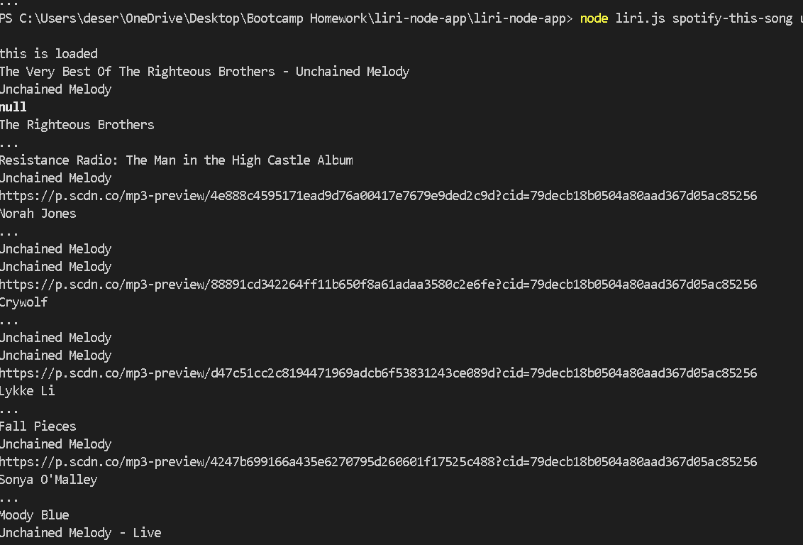

# liri-node-app
LIRI is node aplication based on commands that offers info about concerts, movies, songs

### This is an example:

### API,s used:

1. **Spotify**:
2. **OMDB**:
3. **Bands in Town**:

### .env file needed for Spotify API keys
- This is the .env format:

        SPOTIFY_ID=

        SPOTIFY_SECRET=

